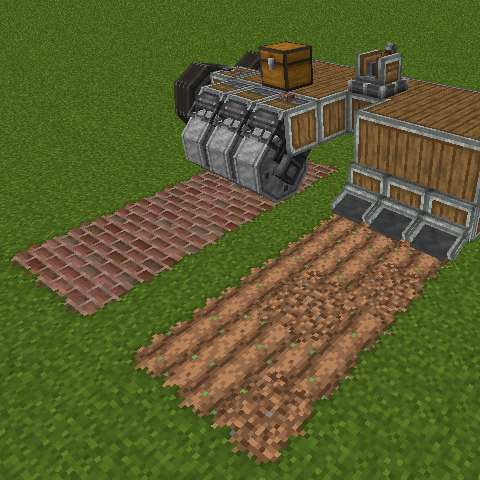

# Create Mod Roller & Plough Fix

  

A NeoForge 1.21.1 addon for Create Aeronautics. It lets Create's Mechanical
Roller and Mechanical Plough act on blocks in the main world while mounted on
Sable simulated contraptions.

## Features

- Mechanical Ploughs act on the projected main-world position as the simulated
  contraption moves.
- Mechanical Rollers pave and clear the projected main world while respecting
  the contraption's current orientation, including inverted contraptions.
- On a simulated contraption, the Roller Mode named **Simulated Behavior**
  enables the projected roller behavior. It is otherwise labelled **Replace
  Tracks** and retains normal Create behavior.
- The simulated roller uses paving blocks from inventories on the same
  simulated contraption.
- Simulated roller animation eases naturally to a stop when the contraption
  reverses, instead of snapping back to its default wheel position.
- Ordinary Create rollers keep their native **Clear Blocks and Pave** behavior
  with Aeronautics/Sable installed, including replacing existing roadbed rather
  than only filling empty spaces.

## Normal Roller Paving Fix

Create Aeronautics/Sable can interrupt Create's usual break-then-pave flow
when a Mechanical Roller encounters existing roadbed. This addon restores the
native Create roller ticker for ordinary, main-world contraptions while leaving
the Sable sub-level behavior in place for simulated contraptions.

As a result, **Clear Blocks and Pave** once again replaces valid existing
roadbed as well as filling empty spaces. The simulated roller's opt-in
**Simulated Behavior** mode remains separate and unchanged.

## Requirements

- Minecraft 1.21.1 with NeoForge
- Create 6.0.10 or newer
- Sable 2.x
- Create Aeronautics 1.3.0 or newer

## Building

Run `gradle build` (or add a Gradle wrapper and run `gradlew build`). The mod
JAR is written to `build/libs`.

## Development Disclaimer

This mod was made with assistance from OpenAI Codex using the GPT-5 model.

## Licensing and Attribution

This addon's original code and artwork are licensed under the MIT License.
It contains adapted MIT-licensed Create code for the ordinary roller paving
compatibility fix; the required attribution and full license text are included
in [THIRD_PARTY_NOTICES.md](THIRD_PARTY_NOTICES.md) and in the built JAR.

The custom **Simulated Behavior** icon is supplied from this mod's own asset
namespace. This addon does not ship or override Create, Sable, or Create
Aeronautics assets, and it is not affiliated with or endorsed by their teams.
